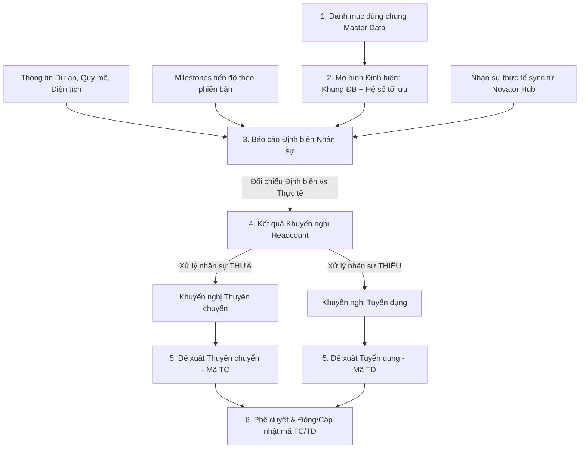

# TÀI LIỆU THIẾT KẾ GIẢI PHÁP & YÊU CẦU PHẦN MỀM (SRS / BRD)
## HỆ THỐNG ĐỊNH BIÊN NHÂN SỰ (HEADCOUNT PLANNING SYSTEM)

---

## 1. Giới thiệu

### 1.1 Bối cảnh
Nhân sự Ban Điều hành Dự án bất động sản được tổ chức theo cấu trúc đa chiều:
* **Địa lý / Phân cấp:** Khu vực $\rightarrow$ Vùng Dự án $\rightarrow$ Dự án.
* **5 Nhóm nghiệp vụ chính trong 1 Dự án:**
  1. `4.0 PMD`: Điều hành Dự án
  2. `4.1 PLP`: Pháp lý Dự án
  3. `4.2 DMD`: Quản lý Thiết kế
  4. `4.3 PCD`: Quản lý Xây dựng, An toàn và Môi trường
  5. `4.4 OM`: Quản lý Vận hành Dự án
* Mỗi nhân sự được gán một chức danh cụ thể trong Bộ chức danh thuộc Ban Điều hành Dự án.

**Thực trạng:**
Việc xác định số lượng nhân sự cần thiết theo chức danh để lập các đề xuất tuyển dụng, thuyên chuyển trước đây thực hiện thủ công, dựa vào ước tính định tính từ HR và Giám đốc/Trưởng phòng ban; chưa có cái nhìn tổng quan dài hạn và cơ sở dữ liệu định lượng phục vụ kế hoạch tuyển dụng.

### 1.2 Mục tiêu
Xây dựng giải pháp phần mềm quản lý định biên nhân sự tự động, chuẩn hóa cho các chức danh thuộc Cụm Điều hành Dự án Bất động sản.

### 1.3 Phạm vi tài liệu
* **Phạm vi nghiệp vụ:** Xác lập nhu cầu nguồn nhân lực phù hợp theo quy mô và tiến độ triển khai Dự án. **Không xét đến các ràng buộc liên quan đến chi phí / ngân sách lương**.
* **Kế thừa & Mở rộng:** Tài liệu được xây dựng trên cơ sở mở rộng từ nền tảng hiện có: *Hệ thống quản lý công việc theo chức danh_PCD*.

### 1.4 Thuật ngữ & Viết tắt

| Thuật ngữ / Viết tắt | Giải thích |
| :--- | :--- |
| **PMD** | Project Management Department - Điều hành Dự án |
| **PLP** | Project Legal Procedure - Pháp lý Dự án |
| **DMD** | Design Management Department - Quản lý Thiết kế |
| **PCD** | Project Construction Department - Quản lý Xây dựng, An toàn và Môi trường |
| **OM** | Operation Management - Quản lý Vận hành Dự án |
| **GMS** | Project Operation System - Phòng Hệ thống Điều hành Dự án |
| **GĐ / PGĐ** | Giám đốc / Phó Giám đốc |
| **KSCC / KS** | Kỹ sư cao cấp / Kỹ sư |
| **HRBP** | Human Resources Business Partner - Nhân sự đối tác kinh doanh |
| **QLTT** | Quản lý trực tiếp |
| **SOP** | Standard Operating Procedure - Quy trình / Hướng dẫn tác nghiệp chuẩn |
| **Novator Hub** | Hệ thống quản lý dữ liệu nhân sự tập trung của tập đoàn |
| **BRD / SRS** | Business Requirement Document / Software Requirement Specification |
| **ĐB / KQKN / TD / TC** | Định biên / Kết quả khuyến nghị / Tuyển dụng / Thuyên chuyển |

---

## 2. Kiến trúc giải pháp tổng thể

Hệ thống hoạt động theo chuỗi liên hoàn từ thiết lập tham số chuẩn đến sinh đề xuất thực tế:

1. **Thiết lập danh mục dùng chung (Master Data):** Khai báo chức danh, phương thức định biên, milestone chuẩn, khu vực - vùng, cơ sở định biên.
2. **Xây dựng Mô hình định biên:** Gồm **Khung định biên** (số lượng nhân sự tối đa cần tại thời điểm cao điểm trong điều kiện chuẩn) và **Hệ số tối ưu** (tỷ lệ điều chỉnh theo từng tháng $T_1, T_2, ...$).
3. **Báo cáo định biên nhân sự:** Kết hợp thông tin dự án, milestone và mô hình định biên để tính toán đối chiếu số lượng định biên chuẩn so với số lượng nhân sự thực tế.
4. **Kết quả khuyến nghị:** 
   * Khuyến nghị thuyên chuyển (dựa trên số lượng nhân sự **THỪA**).
   * Khuyến nghị tuyển dụng (dựa trên số lượng nhân sự **THIẾU**).
5. **Đề xuất tuyển dụng / thuyên chuyển:** Cho phép người dùng xác nhận số lượng (confirm), tự động sinh các mã đề xuất đệ trình phê duyệt và theo dõi trạng thái.

---

## 3. Nền tảng triển khai

* **Loại ứng dụng:** Web Application.
* **Môi trường kế thừa:** Triển khai mở rộng trên nền tảng sẵn có: `gmsp-dev.novagroup.vn`.

---

## 4. Yêu cầu chức năng chi tiết

### 4.1 Module: QUẢN TRỊ (Master Data)

#### a. Quản lý Chức danh (Role) và phân nhóm phương thức chạy định biên
* **Sử dụng trực tiếp danh mục Role:** Hệ thống sử dụng trực tiếp danh mục **Chức danh (Role)** trong hệ thống làm đối tượng chạy định biên (`role.id`, `role.name`).
* **Đồng bộ mã nhân sự từ Novator Hub:** Không cần bảng mapping riêng; bảng `roles` lưu trữ các mã chức danh đồng bộ từ Novator Hub (trường `role.code`) để đối soát nhất quán.
* **Phân nhóm theo 5 Khối/Phòng ban:** Quản lý thông qua quan hệ phòng ban `role.department_id` liên kết tới bảng `departments`:
  * `PMD`: Điều hành Dự án
  * `PLP`: Pháp lý Dự án
  * `DMD`: Quản lý Thiết kế
  * `PCD`: Quản lý Xây dựng, An toàn và Môi trường
  * `OM`: Quản lý Vận hành Dự án
* **Phương thức chạy định biên (`role.planning_method`):** Mỗi chức danh (Role) định nghĩa một phương thức định biên cố định:
  * `01 (BY_SECTOR)`: Định biên theo Khu vực Dự án
  * `02 (BY_REGION)`: Định biên theo Vùng Dự án
  * `03 (BY_PROJECT)`: Định biên theo Dự án
* **Thời gian nhìn trước chuẩn bị tuyển dụng (`role.lead_time_months`):** Số tháng cần chuẩn bị tuyển dụng/onboard trước khi mốc hoặc giai đoạn công việc của chức danh đó bắt đầu.
  * Việc đưa `lead_time_months` về quản lý tập trung tại danh mục Chức danh (`roles`) thay vì gán theo giai đoạn hay khung định biên phản ánh chính xác đặc thù tuyển dụng của từng vị trí trong cùng một mốc/giai đoạn dự án: Ví dụ *Kiến trúc sư thiết kế ý tưởng* cần có mặt trước khi có quyết định thi công 4 tháng (`lead_time_months = 4`), trong khi *Giám đốc PCD* chỉ cần trước 1 tháng (`lead_time_months = 1`), các vị trí kỹ sư giám sát hiện trường cần 0 - 1 tháng.
  * Khi chạy định biên, hệ thống lấy tháng bắt đầu của giai đoạn trừ đi `lead_time_months` của chức danh để kéo vị trí đó vào kỳ kế hoạch tuyển dụng/định biên sớm tương ứng mà không làm thay đổi thời lượng thi công thực tế của dự án.

*Cấu trúc dữ liệu cấu hình Role:*
| Mã Chức danh ĐB (`role.id`) | Tên Chức danh ĐB (`role.name`) | Phòng ban (`department.name`) | Mã chức danh HR (`role.code`) | Phương thức chạy ĐB (`role.planning_method`) | Dung sai tuyển dụng (`role.lead_time_months`) |
| :--- | :--- | :--- | :--- | :--- | :---: |
| M1 | GĐ/PGĐ Quản lý Dự án | PCD | 20047380 20047381 20047382 | 02 (BY_REGION) | 1 tháng |
| M2 | KS/KSCC giám sát xây dựng | PCD | 20047383 20047384 | 03 (BY_PROJECT) | 1 tháng |
| M3 | KTS thiết kế ý tưởng | DMD | 20047390 | 02 (BY_REGION) | 4 tháng |

#### b. Khai báo Khu vực – Vùng (Sector & Region)
* **Cấu trúc phân cấp địa lý:** Khai báo danh mục “Khu vực” (Sector) và “Vùng” (Region).
* **Ràng buộc quan hệ:** 1 Khu vực có thể chứa nhiều Vùng; 1 Vùng chỉ thuộc về duy nhất 1 Khu vực (`regions.sector_id` liên kết với `sectors.id`).
* **Liên kết dự án:** Dự án thuộc về Vùng (`projects.region_id`), từ Vùng tự động xác định được Khu vực tương ứng mà không cần gán trùng lặp.

*Cấu trúc danh mục Khu vực – Vùng:*
| Mã Khu vực (Sector) (`sector.code`) | Tên Khu vực (`sector.name`) | Mã Vùng (Region) (`region.code`) | Tên Vùng (`region.name`) |
| :--- | :--- | :--- | :--- |
| 01 | Đồng Nai | 1.1 | Vùng Đồng Nai 1 |
| 01 | Đồng Nai | 1.2 | Vùng Đồng Nai 2 |
| 02 | Tp.HCM | 2.1 | Vùng Tp.HCM 1 |

#### c. Khai báo danh sách Dự án chạy định biên (Headcount Projects)
* **Mục tiêu:** Cho phép quản trị viên chọn và kích hoạt danh sách các Dự án tham gia vào bài toán chạy định biên nhân sự.
* **Tách biệt Bounded Context:** Bảng `projects` lưu thông tin chung của dự án; việc kích hoạt chạy định biên được quản lý độc lập qua bảng `headcount_projects` (`headcount_projects.project_id` liên kết với `projects.id`) kèm trạng thái kích hoạt (`headcount_projects.is_active`) và ghi chú (`headcount_projects.note`).
* **Hiệu lực hiển thị:** Chỉ các dự án có trạng thái kích hoạt (`is_active = true`) mới hiển thị tại Module Báo cáo định biên (Mục 4.4) và Lập kế hoạch định biên.

*Cấu trúc danh sách Dự án chạy định biên:*
| Mã Dự án (`project.code`) | Tên Dự án (`project.name`) | Trạng thái chạy ĐB (`headcount_projects.is_active`) | Ghi chú (`headcount_projects.note`) |
| :--- | :--- | :--- | :--- |
| Aqua112 | Dự án Aqua City 112ha | Đang áp dụng (true) | Dự án trọng điểm 2026 |
| Aqua81 | Dự án Aqua City 81ha | Đang áp dụng (true) | Phân kỳ 1 |

#### d. Khai báo Cơ sở định biên (Properties - EAV Model)
* **Áp dụng mô hình EAV:** Quản lý linh hoạt danh mục các chỉ số quy mô đo lường dự án qua bảng `properties` mà không cần thay đổi cấu trúc bảng cơ sở dữ liệu.
* **Gắn trực tiếp với Chức danh (Role):**
  * Thuộc tính có thể gắn với `role_id` nếu là chỉ số đặc thù của chức danh đó (ví dụ: số lượng robot ép cọc gắn với Kỹ sư giám sát cọc).
  * Để trống (`role_id = NULL`) nếu áp dụng chung cho toàn dự án (như Diện tích đất, CFA, Quy mô căn, Loại định biên).
* **Cấu trúc trường thuộc tính:** Mã thuộc tính (`code`), Tên hiển thị (`name`), Kiểu dữ liệu (`data_type`: NUMBER, STRING, BOOLEAN, SELECT), Đơn vị tính (`unit`), Lựa chọn (`options` nếu là SELECT), Ghi chú (`description`).

*Cấu trúc danh mục Cơ sở định biên (Properties):*
| Mã thuộc tính (`property.code`) | Tên cơ sở định biên (`property.name`) | Kiểu dữ liệu (`property.data_type`) | ĐVT (`property.unit`) | Lựa chọn (`property.options`) | Chức danh áp dụng (`property.role_id`) |
| :--- | :--- | :--- | :--- | :--- | :--- |
| `LAND_AREA` | Diện tích đất | NUMBER | m2/ha | null | Chung (null) |
| `CFA_AREA` | Diện tích CFA | NUMBER | m2 | null | Chung (null) |
| `SCALE` | Quy mô (Số căn) | NUMBER | SP | null | Chung (null) |
| `ROBOT_COUNT` | Số lượng thiết bị ép cọc | NUMBER | robot | null | KS/KSCC giám sát cọc |
| `CALCULATE_TYPE` | Loại định biên | SELECT | - | `["Min", "Max"]` | Chung (null) |

#### e. Khai báo Milestone chuẩn
* Định nghĩa danh mục mốc tiến độ chuẩn xuyên suốt vòng đời dự án (từ mốc 1: `Start`, mốc 2: `Chấp thuận CTĐT/QĐ trúng đấu giá`, mốc 3: `GPXD/TB khởi công` ... đến mốc 19: `Thoái vốn`).
* **Đồ thị phụ thuộc (DAG):** Quản lý quan hệ phụ thuộc tiền đề qua bảng `milestone_dependencies` (mốc nào phải hoàn thành trước mốc nào).
* **Ràng buộc nghiệp vụ:** Không cho phép xóa milestone nếu milestone đó đã được gán và sử dụng tại bất kỳ Dự án nào.

---

### 4.2 Module: DỰ ÁN

#### a. Thông tin chung dự án & Lưu trữ giá trị Cơ sở định biên (EAV Values)
Kế thừa thông tin dự án hiện tại và nhập liệu cơ sở định biên lưu vào bảng `property_values`:
* **Loại dự án (`project_type`):** Hỗ trợ chọn một hoặc nhiều loại hình (`Cao tầng - HIGH_RISE`, `Thấp tầng - LOW_RISE`, `Tiện ích - AMENITY`).
* **Khu vực & Vùng:** Dự án gán trực tiếp tới Vùng (`projects.region_id`), từ Vùng tự động suy ra Khu vực tương ứng.
* **Giá trị cơ sở định biên theo từng Loại dự án (lưu tại `property_values`):**
  * Dữ liệu được lưu dạng cặp `(project_id, property_id, project_type)` $\rightarrow$ `value_number` / `value_text`.
  * *Ví dụ:*
    * `LAND_AREA`: Diện tích đất (50 ha)
    * `CFA_AREA`: Diện tích sàn xây dựng (150.000 m2)
    * `SCALE`: Quy mô số căn (1.000 căn)
    * `CALCULATE_TYPE`: Loại định biên (`Min` hoặc `Max`)
    * `ROBOT_COUNT`: Số lượng thiết bị ép/đóng cọc (3 robot)

#### b. Nhân sự (Phân bổ vào Dự án & Ràng buộc phương thức ĐB)
* **Nguồn dữ liệu & Lưu trữ:** Dữ liệu nhân sự được đồng bộ tự động từ `Novator Hub` và phân bổ vào các Dự án đang phụ trách (lưu trữ tại bảng `user_projects`).
* **Quy tắc kiểm tra (Validate) theo phương thức định biên (`roles.planning_method`):**
  * `01 (BY_SECTOR)`: Được phép gán cho nhiều Dự án/Vùng khác nhau nhưng bắt buộc tất cả các Dự án đó phải thuộc cùng 1 Khu vực (Sector).
  * `02 (BY_REGION)`: Không được gán cho các Dự án thuộc các Vùng khác nhau (tất cả các Dự án được gán phải có cùng `region_id`).
  * `03 (BY_PROJECT)`: Chỉ được gán cho duy nhất 1 Dự án đang hoạt động (`status = 'ACTIVE'`), không được gán đồng thời cho các Dự án khác nhau.
* **Nguyên tắc phân bổ Headcount thực tế:** Khi nhân sự được gán vào $N$ dự án hợp lệ (thuộc phương thức Vùng hoặc Khu vực), khi chạy Báo cáo định biên (Mục 4.4), hệ thống tự động chia đều: mỗi dự án ghi nhận tỷ lệ $1/N$ headcount thực tế của nhân sự đó.

*Bảng minh họa phân bổ nhân sự vào dự án:*
| Mã NV (`user.per_number`) | Tên nhân sự (`user.full_name`) | Chức danh (`role.name`) | Phương thức ĐB (`role.planning_method`) | Dự án phụ trách (`project.code`) | Tỷ lệ Headcount ($1/N$) |
| :--- | :--- | :--- | :--- | :--- | :---: |
| 35285 | Trần Minh Trí | GĐ/PGĐ Quản lý DA | 02 (BY_REGION) | Aqua112, Aqua81 *(cùng Vùng 1.1)* | $0.5$ |
| 35286 | Lê Văn Cường | KS giám sát xây dựng | 03 (BY_PROJECT) | Aqua112 *(duy nhất 1 DA)* | $1.0$ |

#### c. Quản lý Kế hoạch & Tiến độ Giai đoạn (Plans & Phases)
* **Quản lý kế hoạch theo Phiên bản (Baseline Snapshot):**
  * Lưu trữ tại bảng `plans` theo các trạng thái vòng đời: `DRAFT` $\rightarrow$ `ACTIVE` $\rightarrow$ `ARCHIVED`.
  * Mỗi dự án có thể có nhiều phiên bản kế hoạch qua các thời kỳ, nhưng chỉ có duy nhất 1 phiên bản ở trạng thái `ACTIVE` làm căn cứ chạy định biên.
  * Ngày bắt đầu hiệu lực (`plan.valid_from`): Xác định thời điểm phiên bản kế hoạch bắt đầu có hiệu lực áp dụng để chạy định biên.
  * Khi điều chỉnh tiến độ, hệ thống nhân bản (clone) sang phiên bản mới, đảm bảo bảo toàn dữ liệu lịch sử đối soát của các phiên bản cũ.
* **Mô hình Stage-Gate & Hỗ trợ Giai đoạn gối đầu / Chạy song song (Overlapping Phases):**
  * Kế hoạch của dự án được chia thành các Giai đoạn công việc (bảng `phases`) theo thứ tự (`phase.order_index`).
  * **Hỗ trợ gối đầu / chạy song song (Overlapping):** Trong thực tế thi công dự án (như thực tế dự án Đảo 1), các giai đoạn không bị ép buộc phải nối đuôi nhau cứng nhắc mà có thể chạy gối đầu / cuốn chiếu hoặc song song giữa các phân khu (ví dụ: San lấp chưa kết thúc toàn bộ mặt bằng thì Ép cọc và Thi công hạ tầng kỹ thuật đã có thể bắt đầu thi công tại các phân khu hoàn tất trước).
  * Mỗi giai đoạn được xác định bởi:
    * `Tháng bắt đầu (phase.start_month)`: Tháng thứ mấy của kế hoạch dự án bắt đầu triển khai giai đoạn.
    * `Thời lượng số tháng (phase.duration_months)`: Số tháng thực hiện (tính tròn tháng theo quy định tập đoàn).
    * Tháng kết thúc giai đoạn: $\text{end\_month} = \text{start\_month} + \text{duration\_months} - 1$.
    * Mỗi giai đoạn kết thúc bằng một Mốc tiến độ chuẩn (`phase.milestone_id`) thuộc danh mục 19 Milestone chuẩn.
  * **Tách biệt Tiến độ thi công và Dung sai tuyển dụng:** Giai đoạn thi công chỉ quản lý thời gian thực tế trên công trường (`start_month`, `duration_months`). Dung sai chuẩn bị tuyển dụng được quản lý độc lập theo từng Chức danh tại `role.lead_time_months` (Mục 4.1.a), giúp các vị trí khác nhau trong cùng một giai đoạn có thời gian chuẩn bị tuyển dụng linh hoạt mà không làm biến dạng tiến độ thi công.
  * **Hỗ trợ mốc chốt chặn cố định (`phase.is_anchor`):** Đánh dấu các mốc cam kết tiến độ chiến lược (ví dụ: Mốc Bàn giao nhà cho khách hàng).
* **Cơ chế tịnh tiến bảo toàn độ gối đầu (Cascade Delta Shift):**
  * Chuỗi Phase đầu tiên lấy mốc khởi đầu từ Tháng bắt đầu của dự án (`projects.start_date`).
  * Khi một giai đoạn bị trễ hạn hoặc điều chỉnh tăng thêm $\Delta$ tháng thời lượng, hệ thống tự động tịnh tiến (shift) tháng bắt đầu của toàn bộ các giai đoạn kế tiếp theo chuỗi:
    $$\text{start\_month}_{\text{mới}} = \text{start\_month}_{\text{cũ}} + \Delta$$
    Cơ chế này đảm bảo toàn bộ tiến độ phía sau tự động dịch chuyển đồng bộ, đồng thời **bảo toàn nguyên vẹn khoảng cách gối đầu và cấu trúc song song** giữa các giai đoạn đã thiết lập.
* **Cảnh báo phân tích tác động (Impact Analysis & Deadline Warning):**
  * Nếu chuỗi tịnh tiến đẩy mốc hoàn thành của giai đoạn chạm vào mốc chốt chặn (`phase.is_anchor = true`) hoặc vượt quá Ngày kết thúc cam kết của dự án (`projects.end_date`), hệ thống kích hoạt **Cảnh báo Đỏ (Deadline Impact Warning)** để người dùng chủ động điều chỉnh hoặc tối ưu lại trước khi lưu.

*Bảng 11: Quản lý Phiên bản Kế hoạch Dự án (plans):*
| Phiên bản (`plan.version_name`) | Trạng thái (`plan.status`) | Ngày hiệu lực (`plan.valid_from`) | Ghi chú (`plan.note`) |
| :--- | :--- | :--- | :--- |
| 01 | ACTIVE | 01/01/2026 | Kế hoạch ban đầu |
| 02 | DRAFT | 30/06/2026 | Điều chỉnh tiến độ móng |
| … | … | … | … |

*Bảng 12: Danh sách Giai đoạn & Mốc kiểm soát (phases):*
| Thứ tự (`order_index`) | Mốc chuẩn hoàn thành (`milestone.name`) | Tháng bắt đầu (`start_month`) | Thời lượng (`duration_months`) | Chốt chặn (`is_anchor`) | Ngày dự kiến hoàn thành (`expected_date`) |
| :---: | :--- | :---: | :---: | :---: | :---: |
| 1 | Hoàn tất san lấp mặt bằng (M04) | Tháng 1 | 8 tháng | false | 30/08/2026 |
| 2 | Hoàn tất ép cọc đại trà (M06) | Tháng 6 *(Gối đầu)* | 6 tháng | false | 30/11/2026 |
| 3 | Hoàn tất hạ tầng kỹ thuật (M08) | Tháng 6 *(Song song)* | 8 tháng | false | 31/01/2027 |
| … | … | … | … | … | … |

#### d. Workspace
* Chia thành 5 phân hệ/tab tương ứng với 5 nhóm: `PMD`, `PLP`, `DMD`, `PCD`, `OM`.
* Đối với nhóm **PCD**: Kế thừa chức năng gán nhân sự dự án hiện có (`user_projects`); chuyển trường "Quản lý xây dựng thuộc Dự án" sang phân hệ Workspace - PCD. Các nhóm còn lại tiếp tục hoàn thiện theo lộ trình.

---

### 4.3 Module: MÔ HÌNH ĐỊNH BIÊN

Mô hình định biên là căn cứ cốt lõi để tính số nhân sự cần thiết, được xây dựng theo kiến trúc chuẩn quốc tế (Header - Criteria - Factors) gồm 3 bảng liên kết: **Khung định biên (`headcount_standards`)**, **Điều kiện quy mô lọc AND (`headcount_criteria`)** và **Hệ số tối ưu theo tháng (`headcount_monthly_factors`)**.

#### a. Khung định biên chuẩn (headcount_standards) & Điều kiện quy mô (headcount_criteria)
Mô hình tách bạch giữa Khung định biên tổng thể và các Tiêu chí đo lường quy mô:
1. **Khung định biên tổng thể (`headcount_standards` - Bảng Mẹ):**
   * **Chức danh chạy định biên (`role_id`):** Vị trí nhân sự cần xác định định mức (ví dụ: KS giám sát cọc, KS giám sát san lấp, GĐ Pháp lý...).
   * **Mốc tiến độ áp dụng (`from_milestone_id` $\rightarrow$ `to_milestone_id`):** Giai đoạn công việc mà chức danh đó tham gia tác nghiệp (ví dụ: Từ mốc 1 đến mốc 2).
   * **Chuẩn hóa Dung sai tuyển dụng:** Dung sai tuyển dụng được quản lý tập trung ở bảng `roles` (`role.lead_time_months`), không lưu phân tán tại từng khung định biên hay từng milestone. Khi tính toán, hệ thống tự động kế thừa `roles.lead_time_months` của chức danh để áp dụng thời gian nhìn trước tương ứng.
   * **Cơ chế định mức & Kiểm soát trần - sàn (Governance):**
     * `Định biên chuẩn gợi ý ban đầu (headcount)`: Con số nhân sự chuẩn mực mặc định do hệ thống tự động tính ra làm baseline ban đầu (ví dụ: 1.0, 1.5, 2.0...).
     * `Ngưỡng sàn kiểm soát (headcount_min)` & `Ngưỡng trần kiểm soát (headcount_max)`: Khung biên độ cho phép linh hoạt (ví dụ: 0.02 - 0.04). Khi người dùng lập kế hoạch hoặc điều chỉnh nhân sự theo từng tháng ($T$), giá trị phân bổ bắt buộc phải tuân thủ điều kiện:
       $$\text{headcount\_min} \le \text{Nhân sự tháng T} \le \text{headcount\_max}$$
       Nếu vượt ngoài dải này, hệ thống sẽ cảnh báo vượt khung định biên cho phép.

2. **Điều kiện quy mô lọc AND (`headcount_criteria` - Bảng Con):**
   * Một khung định biên có thể gắn với **nhiều điều kiện quy mô cùng lúc (Logic AND)**:
     * `property_id`: Cơ sở định biên đo lường (Diện tích đất, Quy mô căn, Số robot cọc...).
     * `condition_operator`: Toán tử so sánh (`=`, `<=`, `>=`, `BETWEEN`).
     * `min_value`, `max_value`: Ngưỡng chặn dưới và chặn trên số học.
   * *Ví dụ:* GĐ Pháp lý M1 đồng thời thỏa mãn: `Loại dự án = Thấp tầng` AND `Diện tích đất Between 50 - 100ha` AND `Quy mô <= 1000 căn`.
   * *Quy tắc toàn vẹn dữ liệu:* Khóa duy nhất `(standard_id, property_id, min_value, max_value)` chống khai báo trùng lặp điều kiện.

*Bảng 13: Minh họa Khung định biên và Hệ số tối ưu (Mockup giao diện nghiệp vụ gốc):*

| Mã chức danh ĐB | M1 | | Tên chức danh ĐB | GĐ pháp lý | | | | | | | | | |
| :--- | :--- | :--- | :--- | :--- | :--- | :--- | :--- | :--- | :--- | :--- | :--- | :--- | :--- |
| **KHUNG ĐỊNH BIÊN** | | | | | | **HỆ SỐ TỐI ƯU** | | | | | | | |
| | | | | | | **Mức 1: 7 tháng** | | | | | | | |
| *Cơ sở định biên* | *Điều kiện* | *Giá trị (Min)* | *Giá trị (Max)* | *ĐVT* | | **T1** | **T2** | **T3** | **T4** | **T5** | **T6** | **T7** | |
| Loại Dự án | = | Thấp tầng | | | | 0.5 | 0.5 | 1.0 | 1.0 | 1.0 | 0.5 | 0.5 | |
| Diện tích đất | Between | 50 | 100 | ha | | **Mức 2: 6 tháng** | | | | | | | |
| Quy mô | <= | 1000 | | căn | | **T1** | **T2** | **T3** | **T4** | **T5** | **T6** | | |
| Milestone | | | | | | 0.5 | 0.5 | 1.0 | 1.0 | 1.0 | 0.5 | | |
| *Dung sai tuyển dụng* | | | | | | | | | | | | | |
| From milestone | 1 | -3 | Tháng | | | **Mức ...: ... tháng** | | | | | | | |
| To milestone | 2 | +2 | Tháng | | | **T1** | **T2** | **T3** | … | … | … | | |
| Giá trị định biên min | 0.02 | | | | | 0.5 | 0.5 | 1.0 | … | … | … | | |
| Giá trị định biên max | 0.04 | | | | | | | | | | | | |

*Bảng 14: Minh họa dữ liệu chuẩn hóa trong cơ sở dữ liệu (`headcount_standards` & `headcount_criteria`):*
| Bảng | Chức danh / Standard | Mốc tiến độ | Cơ sở định biên | Điều kiện & Ngưỡng | Định biên gợi ý | Min - Max kiểm soát |
| :--- | :--- | :--- | :--- | :--- | :---: | :---: |
| `headcount_standards` | GĐ pháp lý (M1) | From M1 To M2 *(Lead time 1T kế thừa từ Role)* | *(Gắn 3 tiêu chí)* | | 1.0 | 0.02 - 0.04 |
| `headcount_criteria` | Thuộc GĐ pháp lý (M1) | | Diện tích đất (`LAND_AREA`) | BETWEEN 50 - 100 ha | | |
| `headcount_criteria` | Thuộc GĐ pháp lý (M1) | | Quy mô số căn (`SCALE`) | <= 1.000 căn | | |
| `headcount_standards` | KS giám sát cọc | Hoàn tất ép cọc (M06) *(Lead time 1T từ Role)* | *(Gắn 1 tiêu chí)* | | 1.0 | 1.0 - 1.0 |
| `headcount_criteria` | Thuộc KS giám sát cọc | | Số robot cọc (`ROBOT_COUNT`) | BETWEEN 1 - 1 robot | | |

#### b. Hệ số tối ưu theo tháng (headcount_monthly_factors)
* **Nguyên tắc quản trị (Hướng A - Chuẩn hóa 100% từ Tập đoàn):**
  * Hệ số $T$ theo tháng là **Khuôn mẫu chuẩn (Standard Curve Templates)** được Tập đoàn cấu hình sẵn tại Master Data theo độ dài số tháng của giai đoạn (`duration_months` = 6 tháng, 7 tháng...).
  * Khi Dự án khai báo Kế hoạch tiến độ (`plans` & `phases`), thời lượng giai đoạn được xác định tròn tháng (`phases.duration_months`).
  * **Cơ chế kế thừa tự động:** Khi chạy định biên, hệ thống tự động bốc đúng kịch bản chuẩn có `duration_months = phases.duration_months` từ bảng `headcount_monthly_factors` để nhân với định biên chuẩn `headcount`, điền tự động vào các tháng $T_1, T_2, ...$ của dự án mà không cần nhập tay.
* **Quy tắc Fallback mặc định:** Nếu giai đoạn công việc kéo dài phát sinh ngoài các khuôn mẫu chuẩn đã khai báo, hệ thống tự động áp dụng hệ số bằng **$1.0$** cho tất cả các tháng.

---

### 4.4 Module: BÁO CÁO ĐỊNH BIÊN NHÂN SỰ

Được HRBP kích hoạt định kỳ (hoặc tự động) để rà soát cân đối nhân sự.

#### a. Điều kiện lọc & Kiểm tra tham số nhập liệu
* **Khoảng thời gian:** Chọn `Từ tháng.năm` $\rightarrow$ `Đến tháng.năm`.
  * `Từ tháng.năm` không được nhỏ hơn tháng hiện tại.
  * Khoảng thời gian phân tích tối thiểu phải từ **6 tháng trở lên**.
* **Phạm vi chạy định biên:**
  * Chọn phương thức `01` (Khu vực): Bắt buộc chỉ chọn 1 Khu vực; không chọn Vùng/Dự án.
  * Chọn phương thức `02` (Vùng): Bắt buộc chỉ chọn 1 Vùng; không chọn Khu vực/Dự án.
  * Chọn phương thức `03` (Dự án): Bắt buộc chỉ chọn 1 Dự án trong danh sách hợp lệ; không chọn Khu vực/Vùng.

#### b. Kết cấu Báo cáo & Logic tính toán
Mỗi lần chạy thành công và lưu lại, hệ thống tự động cấp một **Mã Báo cáo (Mã BC)** duy nhất.

*Cấu trúc bảng kết quả (Item):*
| Mã DA | Tên DA | Mã CD | Tên Chức danh ĐB | Tháng 1 (T1) | | | | Tháng 2 (T2) ... | | | |
| :---: | :---: | :---: | :---: | :---: | :---: | :---: | :---: | :---: | :---: | :---: | :---: |
| | | | | **ĐB** | **Thực tế** | **Thừa** | **Thiếu** | **ĐB** | **Thực tế** | **Thừa** | **Thiếu** |
| DAA | Dự án A | M1 | GĐ/PGĐ Pháp lý DA | 0.5 | 0.5 | 0 | 0 | 0.5 | 0.5 | 0 | 0 |
| DAB | Dự án B | M1 | GĐ/PGĐ Pháp lý DA | 0.5 | 0.5 | 0 | 0 | 0.5 | 0.5 | 0 | 0 |
| **SubTotal** | | | | **1.0** | **1.0** | **0** | **0** | **1.0** | **1.0** | **0** | **0** |

*Công thức và logic lấy dữ liệu:*
1. **Cột Định biên:**
   * Ánh xạ thông tin quy mô dự án, tiến độ milestone dự án với bộ điều kiện Khung định biên và nhân với Hệ số tối ưu của tháng tương ứng.
   * *Xử lý lỗi hệ thống:* Báo lỗi rõ ràng nếu thiếu dữ liệu:
     * *"Chưa khai báo khung định biên phù hợp cho chức danh..."*
     * *"Chưa khai báo đủ thông tin Dự án..."*
     * *"Chưa khai báo đủ milestone Dự án ... phù hợp với khung định biên"*
2. **Cột Thực tế:**
   * Lọc toàn bộ nhân sự đang hoạt động có chức danh map với chức danh định biên và đang được phân bổ vào dự án.
   * Lấy tổng nhân sự thực tế chia đều cho số lượng dự án mà nhân sự đó đang phụ trách.
3. **Cột Thừa:**
   $$\text{Thừa} = \begin{cases} \text{Thực tế} - \text{Định biên} & \text{nếu } \text{Thực tế} > \text{Định biên} \\ 0 & \text{ngược lại} \end{cases}$$
4. **Cột Thiếu:**
   $$\text{Thiếu} = \begin{cases} \text{Định biên} - \text{Thực tế} & \text{nếu } \text{Định biên} > \text{Thực tế} \\ 0 & \text{ngược lại} \end{cases}$$

---

### 4.5 Module: KẾT QUẢ KHUYẾN NGHỊ

Từ một Báo cáo định biên đã lưu, người dùng nhấn nút **"Chạy kết quả khuyến nghị"**.
* **Quan hệ:** 1 Báo cáo định biên chỉ liên kết với tối đa 1 Kết quả khuyến nghị (đã lưu).
* Hệ thống sinh ra 2 bảng khuyến nghị độc lập:

#### a. Khuyến nghị Thuyên chuyển (Dựa trên số lượng THỪA)
* **Số lượng thuyên chuyển kỳ này:** Lấy giá trị tại cột `THỪA` làm tròn về phần nguyên bên trái (ví dụ: $1.6 \rightarrow 1$; $0.5 \rightarrow 0$).
* **Số lượng kỳ trước:** Tổng số lượng confirm cần thuyên chuyển của KQKN trước đó có cùng chức danh, cùng phạm vi và trạng thái `Confirm`.
* **Số lượng cần thuyên chuyển:**
  $$\text{SL cần} = \text{SL kỳ này} - \text{SL kỳ trước}$$
* **Số lượng confirm:** Người dùng nhập thủ công, ràng buộc: $\text{SL confirm} \le \text{SL cần}$.
* Nhấn **"Tạo Đề xuất TC"** để chuyển sang module đề xuất.

#### b. Khuyến nghị Tuyển dụng (Dựa trên số lượng THIẾU)
* **Số lượng tuyển dụng kỳ này:** Căn cứ cột `THIẾU` với các quy tắc làm tròn:
  * Giá trị thiếu $\ge 0.5$ làm tròn lên thành $1$.
  * Giá trị thiếu $< 0.5$ làm tròn xuống thành $0$.
  * **Điều kiện bắt buộc:** Mức thiếu phải kéo dài tối thiểu liên tục **3 tháng** trong 1 báo cáo mới ghi nhận nhu cầu tuyển dụng.
* **Số lượng kỳ trước:** Tổng số lượng đã confirm tuyển dụng ở kỳ trước (cùng chức danh, phạm vi).
* **Số lượng cần tuyển dụng:**
  $$\text{SL cần} = \text{SL kỳ này} - \text{SL kỳ trước}$$
* **Số lượng confirm:** Người dùng nhập số lượng phê duyệt thực tế ($\le \text{SL cần}$).
* Nhấn **"Tạo Đề xuất TD"** để tạo mã đề xuất.

#### c. Vòng đời Trạng thái Khuyến nghị
$$\text{Initial (Khởi tạo)} \xrightarrow{\text{Tạo đề xuất}} \text{Confirm} \xrightarrow{\text{Tất cả đề xuất hoàn thành}} \text{Finish}$$

---

### 4.6 Module: ĐỀ XUẤT THUYÊN CHUYỂN / TUYỂN DỤNG

* **Sinh mã tự động:** Khi người dùng xác nhận số lượng confirm, hệ thống sinh ra số lượng dòng tương ứng kèm mã định danh chi tiết:
  * *Ví dụ:* Kết quả khuyến nghị `A123456`, cần tuyển 2 nhân sự $\rightarrow$ Tự động sinh mã `A123456_1` và `A123456_2`.
* **Phân loại mã:**
  * `TC`: Mã đề xuất thuyên chuyển.
  * `TD`: Mã đề xuất tuyển dụng.
* **Tạo mã chủ động:** Cho phép người dùng tự tạo thêm các mã tuyển dụng/thuyên chuyển độc lập (không liên kết với Kết quả khuyến nghị).
* **Quản lý trạng thái:** Cập nhật trạng thái từng mã theo quy trình xử lý thực tế (`Open` $\rightarrow$ `Finished` / `Closed`). Khi toàn bộ các mã con của một khuyến nghị hoàn tất, trạng thái của dòng khuyến nghị tương ứng sẽ chuyển thành `Finish`.
